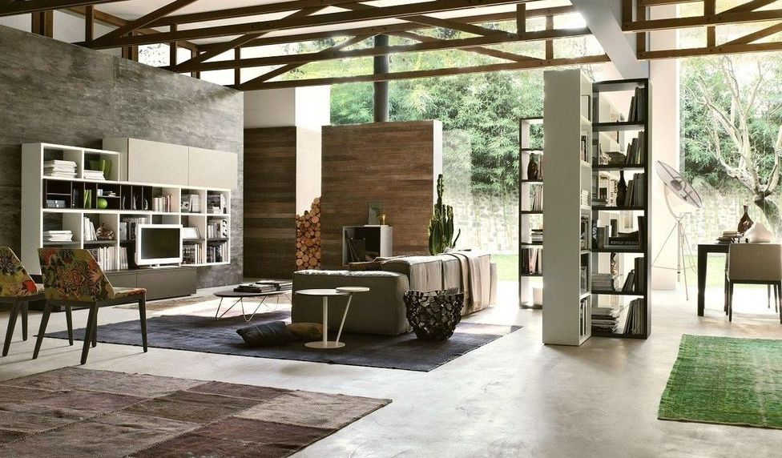
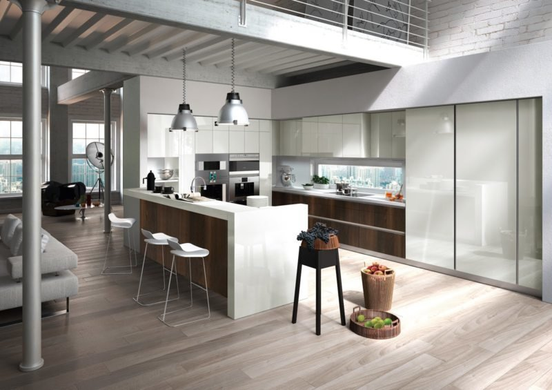
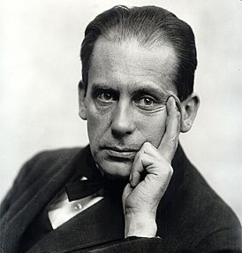

# Баухаус
   
    
 Баухаус — это направление модернистской архитектуры, которое вызвало переворот в мире дизайна.   
 
Баухаус объединил урбанистичность, технологичность, доступность в цене и отражает традиционную немецкую практичность. Баухаус (из немецкого — Bauhaus, что переводится как “дом строительства”) — это направление модернистской архитектуры, которое зародилось в Германии в стенах Высшей школы строительства и художественного конструирования. В 1919 году архитектор Вальтер Гропиус создал “Манифест Баухауза”, в котором изложен принцип взаимодействия художников с ремесленниками. Таким образом архитектура стала почвой для массового производства.

    
Отличительные характеристики баухауса:
      ⠀   
        
- Детали интерьера лаконичны, практичны, имеют простые формы, а главное —удобны в использовании.

- Баухаусу свойственно рациональное использование пространства и минимум декора.

- Используются только нейтральные оттенки: белый, бежевый, серый и черный. Зеленый, синий, желтый и красный выступают в качестве акцентных цветов.
        
- Раздельное освещение — основной принцип баухауса. Каждая функциональная зона должна иметь свой обильный источник света. Вместо декора часто используются светильники или настенные бра. А холодные яркие цвета и светлые стены способствуют визуальному расширению пространства. 
    

     
    
###  Вальтер Гропиус Основатель стиля баухаус в архитектуре 

      
 
